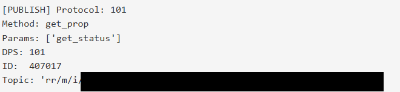

# Roborock MITM Proxy Addon

This is a quick and dirty addon that you can add to your mitm instance to get auto decoding of Roborock MQTT payloads.



## Pre-requisites

1. Prepare your python environment

```
$ uv venv --python=3.13
$ source .venv/bin/activate
$ uv pip install -r requirements_dev.txt
```

2. Obtain the device local key

```
$ python3 local_key.py --email "yourEmailHere" --password "YourPassHere" 
Device ID: a106801c6de44080ac19b2
Device Model: Roborock Living Room
Local Key: KCnRya124dwk9

```

## Installation

Copy `decode.py` to your computer, modify the local key attribute to be equal to your device's localkey.

Run mitm in the same location as the script.

I run with wireguard - I believe to get this working on Android - you have to bypass certificate pinning. 
I do not need to do that on ios. 

The command that works well with my ios device is

`mitmweb --mode wireguard -s decode.py`

Then I setup mitmprxoy like normal on my phone.

## Redirect

This is a script that will modify the login request to allow you to specify your own MQTT server

This works ... kind of...

The app calls out to Roborock and asks for the various servers. The api server: api-region-[roborock].com, the 'wood' 
server which i'm not sure what it is, and the mqtt server. NOTE: There is also a region key, which might be what is 
actually used for pairing and could be explored in the future for injections to change the URL to something like 
api-mycustomdomain.com/.roborock.com


Anyways - to use this script:

You have to login with this script enabled and it will change the mqtt server and the app will then continue to use that
server until you logout and log back in (even with mitmproxy not running)

I was originally hoping that if i removed my device and re-added it, it would get the updated mqtt url from my device, 
but it still calls out to the original.
